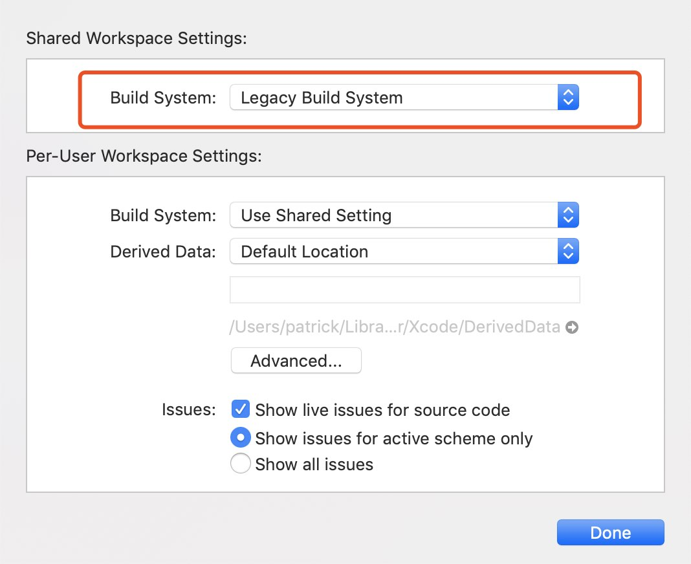
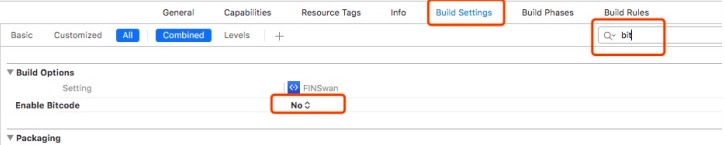

# FinChat SDK iOS demo
本项目演示了如何调用凡泰极客FinChat SDK快速构建一个聊天App。开发者通过这个示范项目了解如何能通过简单的代码把社交能力通过FinChat SDK嵌入到自己的现有App中。本示范项目的编译打包，利用了凡泰极客开发者社区提供的Cocoapods工件仓库，把所需要的SDK系列组件在构建时通过依赖关系管理动态下载。

This project is to demonstrate how to utilise FinChat, FinoGeeks' Instant Messaging SDK, to create a simple app capable of full-featured online social communication. Developers are expected to learn from this example to integrate FinChat into their own mobile applications to socially connect their users and robots. 

## 运行前准备工作

* 1.必须在Mac OS系统中运行。
* 2.确保安装了Cocoapods环境。
 可以在终端中执行:

 ```
 pod -v
 ```
如果能正确输出pod 版本号，则说明cocoapods环境已安装。

## 安装Demo依赖库

执行

```
pod install
```

等待所有依赖安装完毕后，使用`xxxx.xcworkspace`来打开工程。

## 修改工程配置

1. Xcode 10以上的版本，需要修改File->Workspace Settings->Build System为：【Legacy Build System】。



2. 在Project->Build Settings->Bitcode 设置为【NO】。




## 运行工程
如果是试用的话，选择模拟器运行即可。


> 注意：appKey是与bundleId绑定的，如果修改了bundleId，运行Demo时，就会报错appKey无效。
> 所以，如果您需要用在自己的工程里面，请与商务联系合作事宜吧。


最后，SDK的详细集成文档，请看[传送门](https://docs.finogeeks.club/docs/mobile/#/)。

